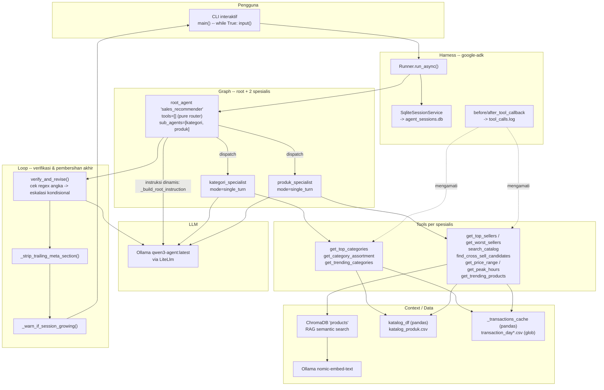
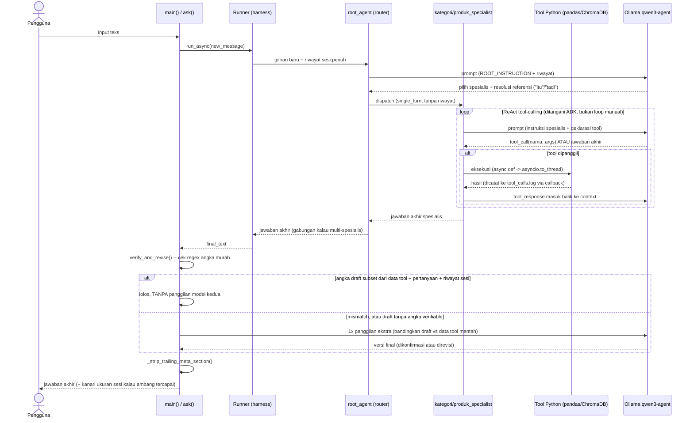
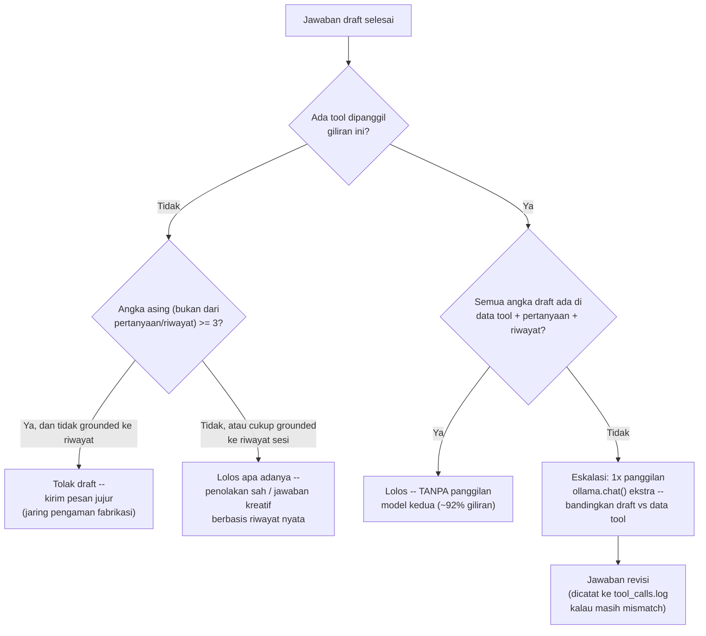

# Infrastruktur Agentic — Peta Prompt / Context / Harness / Loop / Graph

Dokumen ini memetakan `query.py` (dan proyek ini secara umum) ke kerangka
5-lapis yang kamu pakai untuk berpikir soal sistem agentic: **Prompt ->
Context -> Harness -> Loop -> Graph**. Tujuannya: lihat bagian mana yang
sudah ada, bagian mana yang belum, dan tool/library apa (yang sudah
ter-install atau layak ditambah) yang cocok untuk tiap lapisan.

Semua klaim soal `google-adk` di bawah sudah diverifikasi langsung ke kode
sumber yang ter-install di `Lib/site-packages/google/adk/` pada venv ini
(2.8.0+ `[extensions]`), bukan diasumsikan dari dokumentasi umum.

---

## ⚠️ Peringatan: proses yang sedang berjalan saat ini memakai kode LAMA

**STATUS TERBARU (2026-09-06, sore -- ditemukan lagi lewat pengecekan
langsung proses hidup, BUKAN cuma asumsi dari peringatan lama di bawah):**
proses ini MASIH berjalan sekarang, dengan PID BARU (24596, dimulai
06/09/2026 12:13, jadi proses ini di-restart entah oleh siapa SETELAH
peringatan asli di bawah ini ditulis pagi harinya dengan PID 26944) --
tindak lanjut yang disarankan sejak pagi ("hentikan proses lama itu")
**belum pernah dieksekusi**. Dalam rentang waktu proses baru ini berjalan,
SATU fix-wave besar lagi masuk ke `main` (`40f40b2`..`d132c52`, lihat
bagian 7) -- `get_top_sellers_by_day`, perbaikan segmen kosong, perbaikan
routing per-hari, dan koreksi deterministik -- yang proses worktree ini
JUGA tidak punya, DITAMBAH dari sebelumnya. Kalau proses inilah yang
sungguhan dipakai untuk bertanya, seluruh pekerjaan hari ini (bagian 6 DAN
bagian 7) tidak akan terasa efeknya sama sekali.

**Peringatan asli (ditulis pagi hari, 2026-09-06, PID 26944):** ada proses
`python query.py` yang berjalan dari working tree
**`D:/agentic/.worktrees/graph-migration/agentic_dev/rag-env/`**
-- git worktree TERPISAH dari checkout `main` di
`D:/agentic/agentic_dev/rag-env/` (tempat file ini berada). `query.py` di
worktree itu adalah snapshot LAMA (branch `graph-migration` @ `a7ea19e`,
sudah ter-merge ke `main` lewat `c6d4027`) -- dari SEBELUM migrasi data
transaksi v2 (`ca6ae2f` dst.). Konsekuensinya:

- `TRANSACTION_CSV = "D:/agentic/transaction_data/transaction_data.csv"` di
  kode lama itu **menunjuk ke file yang sudah tidak ada** -- direktori
  `transaction_data/` sekarang berisi `transaction_day1.csv`,
  `transaction_day2.csv`, DAN `transaction_day3.csv` (hasil migrasi v2).
  `_load_transactions()` di proses itu akan **gagal (`FileNotFoundError`)**
  begitu tool apa pun yang butuh data transaksi dipanggil -- praktis semua
  tool KECUALI `search_catalog` murni (yang cuma pakai ChromaDB +
  `katalog_df`).
- Proses itu juga TIDAK punya `get_peak_hours`, `get_trending_products`,
  `get_trending_categories`, filter tanggal, ranking net-qty, atau perbaikan
  final-review terbaru (`129e1cb`, `80057a8`) -- semua itu cuma ada di
  `main`, tidak pernah di-merge balik ke branch `graph-migration`.
- Ini pola bug yang PERSIS sama seperti yang sudah pernah terjadi dan
  didokumentasikan di bagian 5 poin 4 ("Follow-up sama hari") -- fix/upgrade
  dikerjakan di satu working tree, tapi proses yang sungguhan dipakai jalan
  dari working tree lain.

**Tindak lanjut yang disarankan (MASIH belum dieksekusi -- keputusan
pemilik proyek, ditanyakan ulang secara eksplisit di sesi 2026-09-06 sore):**
hentikan proses lama itu (PID 24596 per pengecekan terakhir), lalu jalankan
`python query.py` dari `D:/agentic/agentic_dev/rag-env/` (checkout `main`,
yang sudah punya semua perbaikan sampai `d132c52`). Kalau worktree
`graph-migration` sudah tidak dipakai lagi untuk pengembangan aktif (semua
isinya sudah ter-merge ke `main`), pertimbangkan juga `git worktree remove`
untuk itu supaya tidak ada working tree basi yang bisa ke-restart lagi
tanpa sadar -- tapi ini keputusan destructive, jangan dieksekusi otomatis
tanpa konfirmasi eksplisit.

---

## 0. Diagram Arsitektur (Gambar)

Pelengkap visual untuk kerangka 5-lapis (Prompt/Context/Harness/Loop/Graph)
yang dijelaskan panjang lebar di bagian 1-5 di bawah -- baca ini dulu untuk
peta cepat, lalu ke bagian yang relevan untuk detail keputusan, benchmark,
dan riwayat bug-nya. Ketiga diagram di bawah digambar langsung dari struktur
`query.py` yang sungguhan berjalan (root + 2 spesialis, tool per spesialis,
fungsi verifikasi) -- bukan dari ingatan/asumsi. Diagram menunjukkan
struktur YANG DIMAKSUD (happy path); tiga isu diketahui yang belum
diperbaiki (regresi routing PR04, regresi latensi suite-wide, dropout
sintesis cross-sell CP01) tetap ada tapi tidak digambar di sini -- lihat
bagian 5 untuk itu.

### 0.1 Komponen & lapisan

### 0.2 Alur satu giliran (sequence) -- di sinilah Loop & Harness kelihatan jalan

### 0.3 Loop verifikasi akurasi (hybrid) -- detail keputusan & benchmark di bagian 5 #Bagian 2

### 0.4 Pemetaan ke 5 lapis

| Lapisan | Muncul di diagram sebagai | Elemen kunci di `query.py` | Detail lengkap |
|---|---|---|---|
| **Prompt** | edge "instruksi dinamis" di 0.1 | `_build_root_instruction`, `_build_kategori_instruction`, `_build_produk_instruction` -- `InstructionProvider` (callable), bukan string statis | bagian 1 |
| **Context** | subgraph `CONTEXT` di 0.1 | ChromaDB `products`, `katalog_df`, `_transactions_cache`, riwayat sesi (`SqliteSessionService`) | bagian 2 |
| **Harness** | subgraph `HARNESS` di 0.1, partisipan `R`/Runner di 0.2 | `google-adk` `Agent`+`Runner`+`LiteLlm`, `SqliteSessionService`, `before/after_tool_callback` | bagian 3 |
| **Loop** | subgraph `LOOP` di 0.1, blok ReAct + verify di 0.2, diagram penuh 0.3 | tool-calling loop otomatis ADK, `verify_and_revise()` hybrid, `_strip_trailing_meta_section()`, `_warn_if_session_growing()` | bagian 4 |
| **Graph** | subgraph `GRAPH` di 0.1 | `root_agent` (router, `tools=[]`) -> `kategori_specialist` + `produk_specialist` (`sub_agents`+`mode="single_turn"`) | bagian 5 |

---

## Ringkasan Status

> **Update:** item 1-3 di "Ringkasan Prioritas" (aturan kutip-angka-persis,
> tool-call logging, persistensi sesi) sudah diimplementasikan di `query.py`
> dan diverifikasi jalan (restart proses tetap ingat percakapan sebelumnya).
> Ditambah lewat run 104-kasus `test_agent_cases.py`: instruksi dinamis
> (`InstructionProvider`), retry sekali untuk panggilan embedding Ollama,
> kanari ukuran sesi, loop verifikasi akurasi hybrid (`verify_and_revise()`,
> dipilih lewat benchmark nyata di `benchmark_verify_loop.py`), dan 5 bug
> nyata ditemukan+diperbaiki di `query.py` (lihat `rag-setup-windows.md`
> Known Issues, termasuk satu ditemukan lewat testing interaktif pengguna:
> framing "buatkan rekomendasi promo" bikin model menjawab tanpa panggil
> tool sama sekali). Graph Bagian 1 & 2 **sudah diimplementasikan** (lihat
> bagian 5) -- root sekarang pure router (`tools=[]`,
> `sub_agents=[kategori_specialist, produk_specialist]`), diverifikasi
> lewat smoke test live dan regresi penuh 104-kasus (0 error baru), TAPI
> tiga isu diketahui masih belum diperbaiki: regresi routing PR04 (1/104),
> regresi latensi yang ternyata **suite-wide** (bukan cuma kasus compound --
> total waktu suite 104-kasus +318%, median per-kasus +218%, 100/104 kasus
> melambat, kurang `context_cache_config`), dan satu sampel dropout sintesis
> cross-sell di kasus compound paling berat (CP01, 1/4 sampel independen).
> Isu keempat ditemukan BELAKANGAN lewat pengujian interaktif pengguna
> (bukan dari 104 kasus regresi): root melewati delegasi sama sekali untuk
> permintaan bergaya "buatkan rekomendasi promo" -- jawaban lancar tapi nol
> tool dipanggil, jadi kemungkinan besar dikarang. Perbaikan prompt-only
> (`ROOT_INSTRUCTION`) TERBUKTI tidak cukup (bug kambuh lagi di pertanyaan
> identik) -- percobaan memaksa tool-call di level API (`tool_choice`) juga
> GAGAL TOTAL karena LiteLLM membuang parameter itu untuk provider
> `ollama_chat`. Jaring pengaman deterministik SUDAH dipasang di
> `verify_and_revise()` (menolak draft yang menyebut banyak angka konkret
> padahal nol tool dipanggil), tapi ini mencegah fabrikasi terkirim ke
> pengguna, BUKAN membuat root otomatis mengambil data yang benar. Lihat
> bagian 5 untuk kronologi lengkap ketiga percobaan.

| Lapisan | Status | Implementasi saat ini |
|---|---|---|
| **Prompt** | Ada | 3 konstanta instruksi terpisah di `query.py` -- `ROOT_INSTRUCTION` (router, statis), `KATEGORI_INSTRUCTION` (statis), dan `PRODUK_INSTRUCTION` lewat `_build_produk_instruction()` (InstructionProvider, menyisipkan info katalog dinamis: jumlah produk, jumlah ter-index, tanggal update) tiap giliran -- lihat bagian 1 dan bagian 5 untuk detail split root/spesialis |
| **Context** | Sebagian | RAG (ChromaDB) + data terstruktur (pandas) + sesi persisten (`SqliteSessionService` -> `agent_sessions.db`) ada; memori semantik lintas-sesi belum -- **menunggu keputusan scoping** (lihat bagian Context: desain sesi tunggal-abadi saat ini tidak cocok langsung dengan API `BaseMemoryService` yang berbasis multi-sesi) |
| **Harness** | Ada | `google-adk` (`Agent` + `Runner` + `LiteLlm` -> Ollama) + `before_tool_callback`/`after_tool_callback` -> `tool_calls.log` + `test_agent_cases.py` (117 kasus/120 giliran regresi otomatis saat ini, lihat bagian 6) |
| **Loop** | Ada | Tool-calling loop (ReAct-style) dari ADK + retry sekali untuk embedding Ollama + `verify_and_revise()` (loop verifikasi akurasi hybrid, dipilih lewat benchmark nyata) |
| **Graph** | **Bagian 1 & 2 diimplementasikan -- dari 4 isu diketahui, 3 sudah diperbaiki penuh/sebagian, 1 masih terbuka (lihat bagian 6)** | Root router (`tools=[]`) + `kategori_specialist` + `produk_specialist`, plus `verify_and_revise()` untuk Bagian 2 -- diverifikasi lewat smoke test live + regresi 104-kasus (lalu 117-kasus, bagian 6). PR04 **sudah diperbaiki**, dropout sintesis cross-sell CP01 **diperbaiki sebagian**, regresi latensi suite-wide **masih terbuka** (akar masalah: jumlah panggilan LLM penuh bertambah, bukan `context_cache_config` -- itu no-op untuk Ollama), dan isu keempat (root melewati delegasi untuk framing "rekomendasi promo" -- prompt-only fix TERBUKTI tidak cukup, forcing via API TERBUKTI tidak didukung Ollama/LiteLLM) **sudah diperbaiki** lewat jaring pengaman deterministik di `verify_and_revise()` |

Baris ini dulu (sebelum migrasi) berbunyi "**Graph** benar-benar belum
tersentuh sama sekali" -- sudah tidak berlaku lagi, lihat bagian 5.
Konsekuensinya waktu itu sudah kelihatan langsung selama debugging sesi
ini: setiap kali ada jenis pertanyaan baru yang salah pilih tool
("kategori tertinggi" dijawab dari produk, bukan lewat tool kategori),
perbaikannya selalu "tambah baris di satu system prompt yang itu-itu
juga" -- pola yang makin rapuh seiring jumlah tool bertambah (waktu itu
sudah 7). Ini gejala klasik agent tunggal yang mestinya dipecah lewat
Graph -- alasan migrasi ini dikerjakan. Detail & status implementasi ada
di bagian Graph di bawah.

---

## 1. Prompt

**Definisi:** instruksi statis yang membentuk "peran" dan aturan main
model, terpisah dari input pengguna per-giliran.

**Yang sudah ada:**
- **REVISI, lihat bagian Graph #5:** dulu satu `SYSTEM_PROMPT` statis
  (~30 baris, daftar 7 tool dan kapan masing-masing dipakai, plus larangan
  menjawab pertanyaan bertema waktu) -- konstanta itu sudah DIHAPUS oleh
  migrasi Graph. Sekarang ada 3 konstanta instruksi terpisah di `query.py`:
  `ROOT_INSTRUCTION` (router -- pilih spesialis mana yang relevan +
  resolusi referensi lintas-giliran jadi nilai konkret sebelum dispatch),
  `KATEGORI_INSTRUCTION` (spesialis kategori, 2 tool), dan
  `PRODUK_INSTRUCTION` (spesialis produk, 5 tool) -- tiap konstanta cuma
  berisi aturan untuk tool-tool di spesialisnya sendiri, bukan satu daftar
  gabungan 7 tool lagi. Larangan menjawab pertanyaan bertema waktu diulang
  di ketiga instruksi (root menolak duluan untuk kasus jelas, tapi tiap
  spesialis tetap punya penjagaan sendiri untuk kasus yang lolos ke sana).
- Input pengguna per-giliran dikirim terpisah lewat
  `types.Content(role="user", parts=[types.Part(text=query)])` di `ask()`.

**Yang belum:**
- ~~Prompt-nya masih satu blok teks statis dengan 7 aturan routing tool --
  ini justru gejala dari kekosongan di lapisan Graph: routing yang
  seharusnya jadi struktur (node/edge) malah dipaksa jadi aturan bahasa
  alami yang harus terus ditambal.~~ **Selesai, lihat bagian Graph #5:**
  ini persis masalah yang migrasi Graph selesaikan -- routing sekarang
  struktur (`root_agent` + `sub_agents`), bukan lagi aturan bahasa alami
  di satu prompt yang ditambal terus. Instruksi tiap spesialis sendiri
  masih teks statis (bukan struktur node/edge untuk tiap tool individual),
  tapi ukurannya sekarang terikat ke jumlah tool DI SATU spesialis (2-5
  tool), bukan seluruh katalog tool gabungan (7, dan akan terus bertambah).
- Tidak ada mekanisme A/B atau versioning prompt -- setiap perubahan
  langsung mengubah file produksi. (Belum diprioritaskan -- satu pemilik,
  satu deployment, risiko rendah untuk saat ini.)

**Saran tool:**
- ~~`instruction` di `Agent` boleh berupa *callable*
  (`InstructionProvider`)...~~ **Selesai** -- diimplementasikan lewat
  `_build_produk_instruction()` di `query.py`, dipasang HANYA di
  `produk_specialist` (satu-satunya spesialis yang butuh info katalog
  dinamis, lewat `search_catalog`/`find_cross_sell_candidates`) --
  menyisipkan jumlah produk katalog, jumlah yang sudah ter-index ChromaDB,
  dan tanggal katalog terakhir diperbarui ke instruksinya tiap giliran,
  tanpa perlu edit manual saat data berubah. `ROOT_INSTRUCTION` dan
  `KATEGORI_INSTRUCTION` tetap string statis biasa (tidak butuh info
  dinamis apa pun).
- ~~**Kalau prompt makin kompleks:** pindahkan sebagian aturan routing
  (poin 1-7 di `SYSTEM_PROMPT`) ke struktur Graph...~~ **Selesai** -- ini
  sudah persis yang dikerjakan migrasi Graph (lihat bagian 5): routing
  sekarang struktur (`root_agent` + `sub_agents=[kategori_specialist,
  produk_specialist]`), bukan lagi aturan bahasa alami yang ditambal terus
  di satu prompt.

---

## 2. Context

**Definisi:** informasi yang disuntikkan ke model di luar prompt statis --
hasil retrieval, data terstruktur, riwayat percakapan, hasil tool call
sebelumnya.

**Yang sudah ada:**
- **Retrieval semantik (RAG):** koleksi ChromaDB `products`, di-query lewat
  `ollama.embeddings()` + `collection.query()` di `search_catalog` dan
  `find_cross_sell_candidates`.
- **Data terstruktur:** `katalog_df` (pandas, dari `katalog_produk.csv`) dan
  `_transactions_cache` (lazy-load seluruh `transaction_data/transaction_day*.csv`
  yang cocok pola glob, ~3 juta baris gabungan sejak `transaction_time`/
  `item_qty` ditambahkan -- lihat `2026-09-06-transaction-data-v2-design.md`,
  sudah diimplementasikan -- dulu satu file ~1.5 juta baris tanpa kolom
  waktu/kuantitas) -- dipakai langsung sebagai sumber query pandas di semua
  tool lainnya.
- **Riwayat percakapan (session state):** `InMemorySessionService` +
  `SESSION_ID`/`USER_ID` tetap -- context antar-giliran dalam satu proses
  `query.py` yang sama terjaga (ini alasan migrasi ke ADK).
- **Hasil tool call:** otomatis masuk kembali ke context model oleh ADK
  sebagai bagian dari loop tool-calling (lihat bagian Loop).

**Yang belum:**
- ~~**Memori lintas-sesi:** `InMemorySessionService` hilang total begitu
  `query.py` di-restart~~ -- **Selesai** (lihat Ringkasan Prioritas #3):
  sudah pindah ke `SqliteSessionService` -> `agent_sessions.db`, histori
  mentah bertahan lintas restart.
- **Memori semantik lintas-sesi** (beda dari poin di atas -- ini soal
  *mencari* percakapan lama secara semantik, mis. "inget rekomendasi yang
  pernah diberikan bulan lalu", bukan sekadar histori yang tetap ada):
  belum ada. **Catatan arsitektur penting sebelum ini dibangun:** `query.py`
  saat ini cuma punya SATU `SESSION_ID` tetap ("cli_session") yang dipakai
  selamanya -- tidak ada konsep "sesi baru per hari/topik". API
  `BaseMemoryService.search_memory()` (lihat Saran tool) dirancang untuk
  mencari *lintas beberapa sesi* milik satu user/app -- dengan cuma satu
  sesi abadi, tidak ada sesi lama lain untuk dicari. Sebelum
  mengimplementasikan ini, perlu diputuskan dulu: (a) apakah desain sesi
  tunggal-abadi mau diubah jadi multi-sesi (mis. sesi baru tiap hari, sesi
  lama di-`add_session_to_memory()`), atau (b) masalah yang sebenarnya
  ingin diselesaikan adalah lain -- mis. sesi tunggal yang terus tumbuh
  lama-lama melebihi `num_ctx=8192`, yang butuh solusi berbeda
  (summarization/windowing histori, bukan pencarian lintas-sesi).
- **Context per-pengguna:** tidak bisa dibangun dari data yang ada
  (`transaction_data/transaction_day*.csv` tidak punya `user_id`) -- ini
  batasan data, bukan arsitektur, jadi tidak ada tool yang bisa menutupinya.
- ~~**Context temporal:** tidak ada kolom timestamp -- sama, batasan
  data.~~ **Selesai:** `transaction_time` sudah ada di data sejak
  `2026-09-06-transaction-data-v2-design.md` (sudah diimplementasikan) --
  context temporal sekarang bisa dibangun (filter tanggal, trending antar
  hari, jam ramai), dibatasi oleh rentang tanggal yang benar-benar ter-load,
  bukan lagi tidak mungkin sama sekali.

**Saran tool:**
- **Memori semantik lintas-sesi (kalau desain multi-sesi di atas dipilih):**
  `google.adk.memory.BaseMemoryService` (`google/adk/memory/`, diverifikasi
  ke source: `add_session_to_memory(session)` + `search_memory(app_name,
  user_id, query)`, dan `google.adk.tools.load_memory_tool.load_memory`
  sebagai tool siap pakai yang tinggal didaftarkan ke `Agent` kalau
  `Runner` sudah dikasih `memory_service`). Untuk tetap 100% offline,
  implementasi custom `BaseMemoryService` yang menyimpan ke koleksi
  ChromaDB kedua ("conversation_history") jauh lebih murah daripada
  `VertexAiRagMemoryService`/`VertexAiMemoryBankService` bawaan (itu butuh
  cloud, tidak cocok untuk setup offline ini).
- **Kalau masalah sebenarnya adalah context-window (opsi b di atas):**
  tidak perlu memory service sama sekali -- cukup ringkas/pangkas event
  lama di session sebelum dikirim ke model (mis. simpan N giliran terakhir
  utuh + ringkasan giliran sebelumnya), lebih murah dan tidak menambah
  dependency baru.

**Keputusan (dikonfirmasi):** opsi context-window dipilih (bukan memori
semantik lintas-sesi) -- alasan: risiko yang lebih konkret dan lebih dekat
adalah sesi tunggal-abadi tumbuh melebihi `num_ctx=8192`, bukan kebutuhan
mencari sesi lama yang belum ada use case nyatanya. Diverifikasi ke source
(`google/adk/flows/llm_flows/contents.py`): `include_contents="default"`
(default `Agent`) mengirim SELURUH riwayat sesi ke model tiap giliran,
tidak ada windowing/summarization bawaan.

**Diimplementasikan (langkah pertama, sengaja minimal):** `_warn_if_session_growing()`
di `query.py` -- kanari murah yang mencatat peringatan sekali per ambang
batas (60/120/240/480/960 event) begitu ukuran sesi mendekati risiko,
bukan solusi penuh. Sengaja BUKAN summarization otomatis -- itu butuh
panggilan LLM tambahan tiap kali dipangkas (biaya inferensi lagi di
hardware yang sudah terbatas) dan desain sendiri (kapan memangkas, apa
yang tetap utuh, apakah ringkasan lama masih akurat untuk pertanyaan
lanjutan) -- terlalu besar untuk dibangun sebelum ada bukti nyata
masalahnya muncul. Kalau peringatan ini mulai muncul di pemakaian nyata,
itu sinyal untuk membangun windowing/summarization sungguhan.

---

## 3. Harness

**Definisi:** runtime/framework yang merangkai prompt + context + model +
tool jadi satu alur eksekusi -- bukan agen itu sendiri, tapi "mesin" yang
menjalankannya.

**Yang sudah ada:**
- `google-adk`: `Agent` (definisi agent), `LiteLlm` (adapter ke Ollama lewat
  LiteLLM), `Runner` (eksekusi), `InMemorySessionService` (state). Ini
  sudah harness off-the-shelf yang cukup lengkap -- bukan ditulis manual
  (dulu memang manual lewat loop `ollama.chat()`, sudah dimigrasikan).
- Async-safe: semua tool dibungkus `async def` + `asyncio.to_thread` supaya
  tidak memblok event loop harness (perbaikan dari sesi debugging
  sebelumnya).

**Yang belum:**
- ~~**Observability/tracing:** tidak ada logging terstruktur...~~ --
  **Selesai** (lihat Ringkasan Prioritas #2): `before_tool_callback`/
  `after_tool_callback` mencatat tiap panggilan ke `tool_calls.log`.
- ~~**Test/eval otomatis:** pengujian sejauh ini manual...~~ -- **Selesai**:
  `test_agent_cases.py` (mulai dari 104 kasus/107 giliran, sekarang 117
  kasus/120 giliran setelah kasus trending/peak-hours/date-filter/bahasa
  ditambah -- lihat bagian 6) menjalankan `root_agent`
  produksi lewat `InMemorySessionService` terisolasi dan menulis hasil ke
  `test_report.jsonl`. Bukan `adk eval` bawaan (lihat Saran tool di bawah
  untuk kenapa) -- custom karena butuh menilai jawaban akhir secara
  kualitatif (baca teksnya), bukan cuma cocokkan nama tool yang terpanggil.
  Sudah terbukti berguna: run pertama menemukan 3 bug nyata (lihat
  `rag-setup-windows.md` Known Issues) yang lolos dari testing manual.

**Saran tool:**
- ~~Callback/plugin bawaan ADK...~~ **Selesai**, lihat di atas.
- **`google-adk` punya modul evaluation bawaan**
  (`google/adk/evaluation/`, `google/adk/cli/utils/evals.py`) untuk
  mendefinisikan set pertanyaan + tool-call yang diharapkan, lalu
  menjalankannya sebagai regression test (`adk eval`). Belum dipakai --
  `test_agent_cases.py` custom dipilih karena run pertama menunjukkan tool
  yang "salah" dibanding ekspektasi kadang tetap menghasilkan jawaban yang
  benar (strategi tool berbeda tapi valid, lihat contoh SC12 di
  `rag-setup-windows.md`), yang butuh baca teks jawabannya, bukan cuma
  cocokkan nama tool -- kalau `adk eval` punya mode penilaian teks bebas
  yang setara, layak dievaluasi lagi ke depan untuk gantikan/lengkapi
  harness sendiri ini.

---

## 4. Loop

**Definisi:** mekanisme iteratif yang memungkinkan agent memanggil tool,
menerima hasil, lalu memutuskan langkah berikutnya -- sampai kondisi
berhenti tercapai.

**Yang sudah ada:**
- **Tool-calling loop (ReAct-style):** ditangani otomatis oleh
  `Runner.run_async()` di dalam ADK -- model panggil tool, hasil masuk
  balik ke context, model lanjut atau selesai. Tidak ditulis manual;
  ini bagian dari Harness (poin 3) yang otomatis menyediakan Loop.
- **Loop interaktif (human-in-the-loop):** `while True: input()...` di
  `main()` -- loop percakapan CLI, bukan loop otonom.
- **Resiliensi per-giliran:** baru ditambahkan sesi ini -- satu giliran
  yang gagal/timeout/dibatalkan (`try/except` di sekitar `ask()`) tidak
  lagi mematikan seluruh loop.

**Yang belum:** (semua item di bawah sudah selesai per update terbaru)

- ~~**Verifikasi/reflection:** tidak ada langkah "cek ulang" setelah model
  menyusun jawaban akhir...~~ -- **Selesai**: `verify_and_revise()` di
  `query.py`, dipasang di akhir `ask()`. Opsi hybrid dipilih lewat
  benchmark nyata di hardware ini (lihat bagian Graph #Bagian 2 untuk
  angka lengkap) -- cek programatik murah di semua giliran, eskalasi ke
  satu panggilan model kedua cuma kalau ada mismatch atau klaim tanpa
  angka verifiable (~8% giliran, diukur dari 104 kasus nyata).
- ~~**Retry otomatis:** kegagalan satu tool call (mis. Ollama sempat
  lambat) langsung jadi jawaban gagal...~~ -- **Selesai (sebagian)**:
  `_embed()` di `query.py` (dipakai oleh `search_catalog` dan
  `find_cross_sell_candidates`, satu-satunya panggilan I/O ke Ollama yang
  rawan lambat/timeout sesaat) sekarang retry sekali dengan jeda 1 detik
  sebelum menyerah. Tool berbasis pandas murni (`get_top_sellers` dkk)
  tidak butuh ini -- kegagalannya kalau ada berarti bug data, bukan
  transient, jadi retry tidak akan menolong.

**Saran tool:**
- **`google.adk.agents.LoopAgent`** (`google/adk/agents/loop_agent.py`,
  sudah ter-install): workflow agent yang mengulang sub-agent sampai
  kondisi berhenti terpenuhi. Cocok untuk pola "generate jawaban -> cek
  konsistensi dengan hasil tool -> kalau tidak konsisten, ulangi" tanpa
  menulis loop manual sendiri. Masih salah satu opsi yang dipertimbangkan
  untuk verifikasi/reflection di atas -- lihat bagian Graph #Bagian 2.
- ~~Lebih murah dulu sebelum ke LoopAgent: tambah instruksi eksplisit...~~
  **Selesai** -- paragraf "PENTING: kutip angka..." (**REVISI setelah
  migrasi Graph, lihat bagian 5:** dulu satu salinan di `SYSTEM_PROMPT`,
  sekarang diulang di masing-masing dari 3 konstanta instruksi --
  `ROOT_INSTRUCTION`, `KATEGORI_INSTRUCTION`, `PRODUK_INSTRUCTION` --
  karena tiap agent sekarang punya instruksinya sendiri-sendiri).
  Menutup sebagian besar kasus salah-tafsir, tapi tidak semua (`test_report.jsonl`
  dari 104-kasus run masih menunjukkan beberapa kasus perlu chaining tool
  yang tidak selalu terjadi otomatis, mis. kasus MT02/CP04 di
  `rag-setup-windows.md`) -- inilah yang membuat verifikasi programatik di
  atas masih relevan untuk dikerjakan, bukan cuma "selesai karena prompt
  sudah ditambal".

---

## 5. Graph — **Bagian 1 & 2 diimplementasikan (status per isu: lihat bagian 6 untuk update terakhir)**

**Definisi:** struktur eksplisit (node = agent/langkah, edge = alur
kontrol/data) untuk mengoordinasikan lebih dari satu agent atau tahap
pemrosesan -- beda dari Loop (satu agent mengulang dirinya sendiri), Graph
mendistribusikan tugas ke beberapa agent/peran yang berbeda.

**Kondisi saat ini (sebelum migrasi):** satu `root_agent` datar
(`sales_recommender`) dengan 7 tool dan satu system prompt yang mendaftar
semuanya beserta aturan kapan dipakai. Tidak ada `sub_agents`, tidak ada
routing eksplisit, tidak ada tahap terpisah.

**Kenapa dikerjakan sekarang, bukan ditunda:** awalnya rekomendasi di
dokumen ini adalah tunggu sampai jumlah tool lewat 12-15 atau salah-pilih-
tool jadi masalah berulang. Keputusan pemilik proyek: mulai sekarang,
selagi jumlah tool masih kecil (7), supaya migrasi tidak perlu dilakukan
di tengah katalog tool yang sudah besar dan berantakan. Pola bug yang
berulang sepanjang sesi sebelumnya -- "pertanyaan jenis baru muncul ->
model bingung/pilih tool salah -> tambah aturan baru di satu system
prompt" -- tetap jadi alasan utama; migrasi ini menghilangkan pola itu
secara struktural, bukan menambal lagi.

### Desain yang disepakati (bagian 1: struktur routing)

**Mekanisme (proposal awal -- REVISI, lihat spec bagian 2): `google.adk.tools.agent_tool.AgentTool`, BUKAN
`transfer_to_agent`.** `AgentTool` membungkus sebuah `Agent` supaya bisa
dipanggil seperti tool biasa oleh agent lain -- panggil, terima hasil,
kontrol tetap di pemanggil. `transfer_to_agent` sebaliknya adalah
one-way handoff (sub-agent mengambil alih sisa giliran, tidak
mengembalikan kontrol) -- ini akan merusak kebiasaan agent sekarang yang
rutin menggabungkan hasil beberapa tool jadi satu jawaban (mis. produk
terlaris + kategorinya + kandidat cross-sell dalam satu respons). Karena
itu `AgentTool` yang dipilih di proposal awal ini, meski `transfer_to_agent`
sempat disebut di draf awal dokumen ini sebelum perbedaan ini diverifikasi
ke kode sumber. **Direvisi saat implementasi (lihat Status di bawah):**
mekanisme akhir yang benar-benar dipakai di `query.py` adalah
`sub_agents`+`mode="single_turn"`, BUKAN `AgentTool` manual seperti di
atas -- `AgentTool` ternyata didiskon (discouraged) di versi `google-adk`
yang terpasang, lihat `2026-09-05-graph-migration-design.md` bagian 2
untuk detail lengkap dan alasannya.

**Root agent jadi pure router:** `sales_recommender` tidak lagi punya
tool data langsung sama sekali -- semua 7 tool pindah ke spesialis. Di
proposal awal ini, `tools=[]` root cuma berisi `AgentTool` yang
membungkus tiap spesialis (**REVISI, lihat spec bagian 2:** implementasi
akhir memakai `sub_agents=[kategori_specialist, produk_specialist]`
langsung, bukan `AgentTool` -- lihat Status di bawah). Root hanya
bertugas memilih spesialis mana yang relevan dan menyusun hasil akhirnya.
Ini yang membuat prompt root tetap pendek berapa pun jumlah tool di dalam
tiap spesialis bertambah nanti.

**Pengelompokan spesialis -- REVISI, lihat spec detail:** tabel 3-spesialis
di bawah ini adalah proposal AWAL dan sudah DIREVISI jadi 2 spesialis di
`2026-09-05-graph-migration-design.md` bagian 3 (ditemukan: memisahkan
`find_cross_sell_candidates` dari `get_top_sellers`/`get_top_categories`
akan memecah chaining satu-giliran yang baru diperbaiki sesi sebelumnya).
Tabel lama (dipertahankan di sini untuk riwayat keputusan):

| Spesialis (proposal awal, SUDAH DIREVISI) | Tool | Domain pertanyaan |
|---|---|---|
| `kategori_specialist` | `get_top_categories`, `get_category_assortment` | Pertanyaan level kategori |
| `produk_specialist` | `get_top_sellers`, `get_worst_sellers`, `search_catalog` | Pertanyaan level produk |
| `strategi_specialist` | `get_price_range`, `find_cross_sell_candidates` | Pricing & promosi |

Pengelompokan final (2 spesialis) ada di spec bagian 3. Menambah tool
baru nanti = putuskan masuk spesialis mana (atau bikin spesialis baru) --
keputusan kecil dan terbatas, bukan menulis ulang satu paragraf routing
besar seperti sekarang.

**Dikonfirmasi (dengan catatan "dinamis"):** pemilik proyek meminta
pengelompokan ini tetap terbuka menambah lebih dari 3 domain seiring
bertambahnya tool, bukan dikunci selamanya di 3. Di proposal awal ini, itu
didukung otomatis oleh mekanisme `AgentTool` -- `root_agent.tools` cuma
berupa list `AgentTool`, jadi menambah spesialis ke-4/ke-5 nanti = definisikan
`Agent` baru + tambahkan `AgentTool`-nya ke list, TANPA merestrukturisasi
spesialis yang sudah ada (**REVISI, lihat spec bagian 2:** implementasi
akhir memakai `sub_agents=[...]` langsung, bukan `AgentTool` -- prinsip
"tambah spesialis = tambah satu entri ke list" tetap sama persis, cuma
listnya `sub_agents` bukan daftar `AgentTool`). Tabel 3-domain di atas
jadi konfigurasi AWAL untuk 7 tool yang ada sekarang, bukan plafon
arsitektur.

### Bagian 2 (selesai -- diimplementasikan): loop verifikasi akurasi

Diminta terpisah: proses yang mengecek jawaban akhir cocok dengan hasil
tool sebelum sampai ke pengguna, dan mencoba ulang kalau tidak cocok --
ini sebenarnya perluasan dari gap di bagian **Loop** (lihat di atas),
bukan bagian dari Graph itu sendiri, tapi didesain bersamaan karena
diminta dalam paket yang sama.

**Benchmark nyata dulu, sebelum memilih** (`benchmark_verify_loop.py`,
diukur langsung di hardware ini -- RTX 5060 8GB VRAM, `qwen3-agent:latest`):

| Opsi | Cara ukur | Hasil |
|---|---|---|
| Baseline (tanpa verifikasi) | 4 pertanyaan representatif (simple + compound) lewat `root_agent` asli | rata-rata **31.2s/giliran** |
| Kritik model kedua tiap giliran (LoopAgent-style) | panggilan `ollama.chat()` kedua per pertanyaan yang sama, prompt mengecek draft vs data tool | rata-rata **17.4s tambahan** -> **48.6s/giliran, SELALU** (+56%) |
| Cek programatik (regex angka + set comparison) | 4000x panggilan `timeit`-style | **0.019 ms/panggilan** -- praktis nol |
| VRAM sebelum/sesudah kritik | `nvidia-smi` snapshot | 7691 MiB (96% util) -> 7331 MiB (35% util) -- **tidak ada model swap/thrashing** (kritik pakai model yang sama, bukan model kedua terpisah), tapi VRAM sudah ~94% terpakai saat generate SATU model saja -- headroom tipis |
| Rasio giliran yang butuh eskalasi (hybrid) | dari 104 kasus nyata `test_report.jsonl`: giliran yang jawabannya tidak punya angka verifiable sama sekali | **9/107 (8.4%)** -- lalu diperketat lagi saat implementasi (lihat di bawah): giliran TANPA tool dipanggil sama sekali (mis. penolakan tema waktu) dikeluarkan dari hitungan ini karena tidak ada yang bisa/perlu diverifikasi, jadi rasio nyata di produksi lebih rendah dari 8.4% |

**Proyeksi rata-rata latensi/giliran:** programatik-saja ~31.2s (tapi nol
cakupan untuk klaim kualitatif) vs LoopAgent-tiap-giliran ~48.6s (SELALU)
vs **hybrid ~32.7s** (31.2s + 8%*17.4s). Hybrid menang telak -- overhead
rata-rata cuma +4.8% dibanding +56% punya LoopAgent, dan VRAM yang sudah
mepet (94% terpakai saat idle-generate) membuat beban ganda PERMANEN di
setiap giliran (opsi LoopAgent) berisiko lebih tinggi daripada beban ganda
SESEKALI (opsi hybrid, cuma saat eskalasi).

**Keputusan:** hybrid dipilih dan diimplementasikan di `query.py`:
- `_extract_numbers()` + perbandingan set: cek murah dulu, jalan di SETIAP
  giliran yang tool-nya dipanggil.
- Giliran TANPA tool dipanggil sama sekali (mis. penolakan tema waktu) --
  langsung dilewati, tidak ada yang bisa diverifikasi tanpa data tool.
- Kalau draft punya angka dan semuanya cocok dengan data tool giliran itu
  -> selesai, TANPA panggilan model kedua.
- Kalau draft punya angka yang TIDAK cocok, ATAU draft tidak punya angka
  verifiable sama sekali (klaim kualitatif) -> eskalasi SATU panggilan
  `ollama.chat()` tambahan yang membandingkan draft dengan data tool
  mentah (`_current_turn_tool_outputs`, dikumpulkan langsung dari
  `tool_response` asli di `after_tool_callback` -- BUKAN dari baris log
  `tool_calls.log` yang cuma metadata) dan mengembalikan versi final
  (dikonfirmasi sama, atau direvisi).
- `ask()` di `query.py` sekarang memanggil `verify_and_revise()` di akhir
  tiap giliran -- otomatis berlaku untuk `main()` (CLI produksi) DAN
  `test_agent_cases.py` (di-refactor supaya reuse `ask()` yang sama,
  bukan duplikat loop-nya sendiri, supaya suite regresi menguji jalur yang
  sungguhan dipakai pengguna).

**Batasan yang jujur diakui:** langkah revisi ini sendiri berbasis model
lokal, jadi PROBABILISTIK, bukan jaminan keras -- diamati langsung saat
verifikasi: dari beberapa percobaan dengan angka yang sengaja dipalsukan,
1 percobaan gagal (model cuma mengulang draft yang salah apa adanya),
sisanya berhasil mengoreksi ke angka yang benar. Tidak ditambah retry
otomatis di sini (itu menghilangkan penghematan biaya hybrid) -- sebagai
gantinya, kalau hasil revisi MASIH mismatch dengan data tool, itu dicatat
ke `tool_calls.log` (baris `NOTE ... verify_and_revise | MASIH
MISMATCH...`, prefix "NOTE " supaya `test_agent_cases.py` tidak salah
menganggapnya sebagai tool yang terpanggil) supaya kegagalan ini kelihatan
untuk investigasi, bukan diam-diam terkirim ke pengguna tanpa jejak.
Catatan penting: opsi LoopAgent-tiap-giliran PUN tidak lebih andal dari
ini -- keduanya pakai model lokal yang sama, jadi biaya ekstra LoopAgent
tidak membeli keandalan ekstra, cuma membeli kesempatan mencoba di setiap
giliran alih-alih cuma yang butuh eskalasi.

**Dua bug nyata ditemukan SETELAH implementasi awal, lewat pengecekan
langsung (bukan cuma percaya proyeksi ~8% dari benchmark) -- keduanya
sempat bikin proses uji ulang macet/jauh lebih lambat dari proyeksi:**

1. **Marker list bernomor dianggap "angka data".** Jawaban markdown yang
   umum dipakai model ini ("1. **Produk A** ... 2. **Produk B** ...")
   membuat regex ekstraksi angka menangkap "1", "2", dst. sebagai angka
   yang harus dicocokkan ke data tool -- padahal itu cuma nomor urut list,
   dan data tool sendiri berformat bullet "-" (tidak bernomor), jadi
   "1"/"2" HAMPIR TIDAK PERNAH cocok. Efeknya: eskalasi ke model kedua
   terjadi di HAMPIR SETIAP giliran berformat list (bukan cuma ~8%), dan
   proses uji 12-kasus yang sedang berjalan sempat macet karenanya.
   Diperbaiki: `_LIST_MARKER_RE` membuang marker list ("^\s*\d+[.)]\s+")
   sebelum ekstraksi angka.
2. **Angka yang diulang dari pertanyaan pengguna sendiri dianggap
   "mismatch".** Setelah bug #1 diperbaiki, rasio eskalasi masih ~50%
   (bukan ~8%) -- diselidiki dengan membandingkan draft & data tool MENTAH
   untuk satu kasus nyata ("5 produk terlaris untuk sabun mandi"): draft
   dimulai "Berikut **5** produk terlaris...", mengulang angka "5" dari
   PERMINTAAN pengguna sendiri (bukan dari data tool) -- pola ini sangat
   umum ("top 5", "harga di bawah 10000") karena memang begitu cara wajar
   menjawab. Diperbaiki: `_verify_and_revise_impl` sekarang menerima
   `question` (pertanyaan asli giliran itu) dan menganggap angka dari
   PERTANYAAN, bukan cuma dari data tool, sebagai valid juga
   (`allowed_nums = tool_nums | _extract_numbers(question)`).

Pelajaran dari kedua bug ini: benchmark awal (~8% eskalasi) diukur dari
104 kasus yang SUDAH lolos, bukan dari mengamati mekanisme cek itu sendiri
gagal/berhasil pada teks mentah -- proyeksi biaya dari benchmark tetap
valid sebagai perbandingan ANTAR opsi (hybrid tetap jauh lebih murah dari
LoopAgent-tiap-giliran), tapi angka absolutnya (~8%) sempat meleset jauh
sampai kedua bug di atas diperbaiki. Setelah diperbaiki dan diuji ulang
langsung terhadap kasus yang sebelumnya gagal, kedua kasus repro (list
bernomor, angka dari pertanyaan) sudah tidak eskalasi lagi seperti
seharusnya.

**Validasi akhir (12 kasus/14 giliran representatif, setelah kedua bug di
atas diperbaiki):** 493.6 detik total (~35s/giliran rata-rata), **0
error**. Eskalasi terjadi di 2/14 giliran (~14%) -- turun drastis dari
~100% (bug list-marker) dan ~50% (bug angka-dari-pertanyaan), mendekati
proyeksi awal ~8%. Kedua eskalasi yang tersisa diselidiki: sama-sama pola
bug #1 (marker urut seperti "4."/"5.") tapi dalam bentuk yang TIDAK
tertangkap `_LIST_MARKER_RE` karena tidak persis di awal baris (mis.
tercampur baris lain sebelum nomor urutnya). **Keputusan sadar: tidak
dikejar lagi** -- dua ronde perbaikan sudah menurunkan tingkat eskalasi
mendekati target awal, dan tiap pola markdown baru yang mungkin muncul
dari model generatif ini sulit dienumerasi habis lewat regex; residual
~14% ini bukan kesalahan data (2 kasus itu tetap dicatat & terlihat di
`tool_calls.log`, bukan kegagalan senyap), cuma biaya ekstra kecil yang
lebih murah daripada terus menambal regex untuk kasus yang semakin jarang.

**Di luar cakupan migrasi ini (sengaja ditunda, didiskusikan terpisah):**
agent yang menulis tool baru secara otonom saat tidak ada tool yang cocok.
Ini sempat diusulkan tapi ditahan karena risikonya nyata: kode baru yang
ditulis dan dijalankan tanpa review manusia, oleh model lokal 8B, langsung
terhadap data penjualan asli -- kelas kesalahan yang sepanjang sesi-sesi
sebelumnya justru banyak ditemukan di kode yang *sudah* ditulis dan
direview manusia. Butuh desain guardrail sendiri (sandboxing eksekusi,
alur review sebelum tool baru dipercaya) sebelum layak dibangun.

**Status:** Bagian 1 (struktur routing + pengelompokan spesialis) **sudah
diimplementasikan** di `query.py`: `root_agent` sekarang pure router
(`tools=[]`, `sub_agents=[kategori_specialist, produk_specialist]`, pakai
`sub_agents`+`mode="single_turn"` sesuai revisi mekanisme di spec --
BUKAN `AgentTool` manual seperti draf awal dokumen ini, lihat
`2026-09-05-graph-migration-design.md` bagian 2). Pengelompokan final 2
spesialis (bukan 3 seperti proposal awal di bawah): `kategori_specialist`
(`get_top_categories`, `get_category_assortment`) dan `produk_specialist`
(`get_top_sellers`, `get_worst_sellers`, `search_catalog`,
`find_cross_sell_candidates`, `get_price_range` -- `find_cross_sell_candidates`
sengaja tetap satu spesialis dengan `get_top_sellers` supaya chaining
satu-giliran yang sudah diperbaiki sebelumnya tidak pecah, lihat spec
bagian 3). Root dan spesialis pakai pasangan callback terpisah
(`_log_before_tool_root`/`_log_after_tool_root` vs `_log_before_tool`/
`_log_after_tool`) supaya baris log dispatch-routing root tidak pernah
mencemari kumpulan ground-truth `verify_and_revise` (koreksi yang
ditemukan saat review Task 1, spec bagian 9). Context lintas-giliran
(spesialis TIDAK menerima riwayat percakapan sama sekali tiap dipanggil)
ditangani lewat root yang meresolusi referensi ("itu"/"situ"/"tadi") jadi
nilai konkret sebelum dispatch ke spesialis -- diverifikasi jalan lewat
smoke test live (spec bagian 10, Opsi A).

Diverifikasi lewat rangkaian smoke test live (Ollama nyata, bukan mock)
dan regresi penuh:
- Routing per-spesialis + separasi log root/spesialis: jalan
  (`smoke_test_specialists.py`).
- Chaining tool lintas-panggilan dalam satu spesialis (`get_top_sellers`
  -> `find_cross_sell_candidates`) tetap jalan (`smoke_test_chaining.py`).
- Resolusi referensi lintas-giliran (spec bagian 10, Opsi A): root selalu
  substitusi nilai konkret, tidak pernah meneruskan referensi mentah ke
  spesialis (`smoke_test_context_handoff.py`).
- Regresi penuh 104-kasus vs. baseline pra-migrasi
  (`compare_migration_report.py`, `test_report.jsonl` vs.
  `test_report_pre_migration.jsonl`): **0 error baru**.

~~**Tiga temuan dari regresi 104-kasus, BELUM diperbaiki, dicatat di sini
supaya tidak terkubur**~~ **UPDATE (lihat bagian 6): dari tiga temuan ini, #1
(PR04) sudah diperbaiki penuh dan #3 (dropout CP01) diperbaiki sebagian --
cuma #2 (regresi latensi) yang masih benar-benar terbuka** -- status
per-item ada di catatan "DIPERBAIKI"/masih terbuka di bawah tiap nomor
(temuan keempat, ditemukan terpisah lewat pengujian interaktif pengguna dan
SUDAH diperbaiki, ada di bawah nomor 4):

1. **Regresi routing PR04 (terisolasi, 1/104, tapi nyata):** pertanyaan
   rentang harga yang memakai kata "kategori" ("berapa harga median
   kategori Keripik & Kerupuk") salah dirutekan ke `kategori_specialist`
   (tidak punya tool harga) alih-alih `produk_specialist`, hasilnya
   penolakan yang salah secara faktual ("data tidak mengandung informasi
   harga") padahal baseline pra-migrasi menjawab benar. 9 kasus
   `get_price_range` lainnya tetap rute dan jawab benar baik sebelum
   maupun sesudah migrasi. **Tindak lanjut:** perketat instruksi routing
   `ROOT_INSTRUCTION` untuk pertanyaan harga yang memakai kata "kategori",
   lalu uji ulang.
   - **DIPERBAIKI (sesi lanjutan):** tambah paragraf eksplisit di
     `ROOT_INSTRUCTION` yang membedakan "kategori" sebagai TOPIK
     (kategori_specialist) vs "kategori" sebagai PENUNJUK SEGMEN untuk
     pertanyaan harga/produk (WAJIB produk_specialist, karena
     kategori_specialist tidak punya tool harga sama sekali). Diverifikasi
     LANGSUNG lewat kasus asli PR04 (`berapa harga median kategori
     Keripik & Kerupuk`) via `run_case()`: sekarang rute ke
     `produk_specialist` -> `get_price_range`, jawaban benar (Rp10.500
     median, 286 produk) -- sebelumnya salah rute ke `kategori_specialist`
     dan menolak faktual salah.
2. **Regresi latensi -- SUITE-WIDE, bukan cuma kasus compound:** dihitung
   langsung dari `test_report.jsonl` (pasca-migrasi) vs.
   `test_report_pre_migration.jsonl` (pra-migrasi), `sum(duration_sec
   tiap giliran)` per kasus, semua 104 kasus di kedua file: **total waktu
   suite 1685s -> 7040s (+318%)**, **median perubahan per-kasus +218%**,
   **100 dari 104 kasus melambat** (85 di antaranya lebih dari 100% lebih
   lambat). Kasus terburuk BUKAN kasus compound: CS06 (+1632%), CS03
   (+1146%), PR09 (+1120%, 6.1s->74.4s) -- ketiganya kasus satu-topik
   biasa. Median pasca-migrasi berdasar jumlah dispatch spesialis per
   kasus: 0 spesialis terpanggil (mis. penolakan tema waktu) ~7s, 1
   spesialis ~50s, 2+ spesialis ~154s -- pola ini konsisten dengan akar
   masalah di bawah (tiap dispatch root->spesialis membayar biaya penuh
   satu hop LLM ekstra tanpa cache), bukan spesifik ke bentuk pertanyaan
   compound. CP01-CP05 (kasus compound, dikutip di draf laporan
   sebelumnya) tetap melambat 117%-773% dan masih satu titik data yang
   valid dan ilustratif (lebih berat dari median karena men-dispatch 2+
   spesialis), TAPI itu bukan cerita lengkapnya -- regresi ini melanda
   hampir seluruh suite, bukan cuma kasus compound. Akar masalah sudah
   teridentifikasi (belum diperbaiki): agent-agent di `query.py` tidak
   punya `context_cache_config`, jadi ADK mengirim ulang seluruh prompt
   tanpa-cache (system instruction + deklarasi tool + histori) tiap kali
   transfer root->spesialis, alih-alih pakai cache -- dikonfirmasi lewat
   warning startup ADK sendiri, dan konsisten dengan pola "makin banyak
   dispatch spesialis, makin lambat" di atas. **Catatan kejujuran:** kedua
   run (`test_report.jsonl`, `test_report_pre_migration.jsonl`) dijalankan
   di sesi terpisah, jadi ada kemungkinan variansi kontensi VRAM ikut
   berkontribusi -- tapi pola 100/104 kasus melambat dengan median +218%
   jauh melebihi yang bisa dijelaskan cuma oleh confound semacam itu.
   **Tindak lanjut YANG DISARANKAN SEBELUMNYA -- diinvestigasi, TERBUKTI
   tidak berlaku untuk stack ini (jangan diulang):** `context_cache_config`
   dibaca sampai ke `google/adk/models/_prompt_cache.py`, yang docstring-nya
   sendiri bilang: "Gemini caches by creating a server-side resource...
   Claude instead caches whatever prefix the request marks, and a model
   reached through LiteLLM inherits whichever of the two its provider
   implements" -- mekanismenya SELALU `cache_control_injection_points`
   (gaya Anthropic, prefix-marking), cuma diterapkan kalau provider ada di
   `_ANTHROPIC_PROVIDERS = {"anthropic", "bedrock", "vertex_ai"}`
   (`lite_llm.py`). `ollama_chat` TIDAK ada di daftar itu, dan digrep
   langsung ke source litellm terpasang (`litellm/main.py`,
   `litellm/llms/ollama/chat/transformation.py`): satu-satunya kode yang
   memproses `cache_control` di litellm ada di
   `anthropic_cache_control_hook.py` -- TIDAK ADA path ollama sama sekali.
   Ini sama persis pola "kelihatan seperti fix API tapi no-op di stack
   ollama_chat" yang sudah terbukti di isu #4 (`tool_choice`) -- root
   masalah sebenarnya kemungkinan besar BUKAN soal caching prompt (Ollama
   sendiri sudah otomatis reuse KV-cache server-side untuk prefix identik,
   tidak butuh flag klien manapun), tapi soal jumlah panggilan LLM PENUH
   yang bertambah (root memutuskan rute + spesialis menjawab = 2 model run
   dibanding 1 sebelumnya) -- growth ini didominasi biaya DECODE (generate
   token baru), bukan PREFILL (proses ulang prompt lama), dan caching
   prompt/prefix tidak menolong biaya decode sama sekali. **Tidak
   diimplementasikan** -- mengonfigurasi `context_cache_config` di sini
   diproyeksikan jadi kode mati lagi, bukan fix nyata. Kandidat tindak
   lanjut yang lebih relevan (belum dicoba, belum diverifikasi): kurangi
   `num_predict`/panjang jawaban spesialis, atau terima 1-hop-tambahan ini
   sebagai trade-off sadar dari migrasi Graph (akurasi routing vs latensi).
3. **Dropout sintesis cross-sell di CP01 (1 dari 4 sampel independen):**
   CP01 (`kasih rekomendasi lengkap: produk terlaris kategori Personal
   Care, rentang harganya, dan produk cross-sell-nya`) adalah kasus
   compound paling berat di suite (3 tool dirangkai dalam satu giliran).
   Ditemukan lewat Task 4: dari 4 sampel independen live yang dijalankan
   terhadap kasus ini, mekanisme tool-chaining-nya sendiri benar di
   SEMUA 4 sampel (`get_top_sellers` -> `get_price_range` ->
   `find_cross_sell_candidates`, semua terpanggil dalam satu giliran
   `produk_specialist`, persis desain spec bagian 3). Tapi 1 dari 4
   sampel gagal di langkah SINTESIS jawaban akhir: `produk_specialist`
   memanggil `find_cross_sell_candidates` dengan benar, lalu menulis
   jawaban akhir yang menyebut NOL kandidat cross-sell -- alih-alih itu,
   menyarankan produk terlaris itu sendiri sebagai target cross-sell-nya
   sendiri (secara konsep terbalik: kandidat cross-sell semestinya produk
   LAIN yang penjualannya lebih rendah, bukan produk yang sama). 3 dari 4
   sampel berhasil menyebut kandidat cross-sell konkret dan nyata (2 di
   antaranya bahkan cocok sebagian/besar dengan kandidat yang disebut
   baseline pra-migrasi). **Bukan diperkenalkan oleh migrasi ini** -- pola
   sintesis lemah yang sama (tool terpanggil benar, tapi jawaban akhir
   tidak sepenuhnya mengangkat hasilnya) sudah ada SEBELUM migrasi di
   kasus lain (mis. MT02 giliran ke-2, lihat `test_report_pre_migration.jsonl`).
   Detail lengkap 4 sampel ada di
   `.superpowers/sdd/2026-09-05-graph-migration-plan/task-4-report.md`
   (bagian "Fix report (round 2)" dan "Revised, unsoftened conclusion").
   **Tindak lanjut:** bukan bug spesifik migrasi untuk diperbaiki di sini,
   tapi risiko nyata (jawaban lancar yang diam-diam menghilangkan data
   yang justru diminta) yang butuh investigasi terpisah -- kandidat: perkuat
   `PRODUK_INSTRUCTION` agar mewajibkan ketiga bagian yang diminta
   benar-benar hadir di jawaban akhir, atau perluas `verify_and_revise()`
   untuk mendeteksi "bagian yang diminta tapi diam-diam hilang", bukan
   cuma mismatch angka.
   - **DIPERBAIKI SEBAGIAN (sesi lanjutan):** `PRODUK_INSTRUCTION` diperkuat
     persis seperti kandidat di atas -- (a) kandidat cross-sell WAJIB
     produk LAIN berpenjualan lebih rendah, JANGAN sarankan produk acuan
     itu sendiri; (b) kalau tool cross-sell benar-benar tidak mengembalikan
     kandidat, katakan terus terang, jangan mengarang; (c) untuk permintaan
     majemuk, jawaban akhir wajib memuat hasil SETIAP tool yang dipanggil,
     jangan diam-diam menghilangkan satu bagian. Diverifikasi lewat 2
     sampel live CP01 independen (`run_case()`, bukan cuma dibaca):
     sampel 1 -- tool cross-sell tidak menemukan kandidat (nama produk
     yang dikirim ke tool ternyata sudah digeneralisasi model jadi "Facial
     Cleanser", bukan nama katalog persis -- gap TERPISAH, lihat catatan
     di bawah) dan jawaban SEKARANG mengatakan itu terus terang, tidak lagi
     menyarankan produk terlaris sebagai cross-sell-nya sendiri (pola bug
     asli). Sampel 2 -- tool cross-sell berhasil dan jawaban menyebutkan 3
     kandidat KONKRET yang berbeda dari produk acuan (Natur-e, Paseo, Bebek
     Cairan Pembersih Kloset). **Gap terpisah ditemukan saat verifikasi ini
     (belum diperbaiki, dicatat supaya tidak terkubur):** di sampel 1,
     `produk_specialist` memanggil `find_cross_sell_candidates` dengan
     `product_name="Facial Cleanser"` (istilah generik hasil parafrase
     model) padahal `PRODUK_INSTRUCTION` poin 4 sudah eksplisit minta nama
     PERSIS dari hasil `get_top_sellers` -- pencarian semantik lalu gagal
     karena istilah generik tidak dekat secara embedding dengan nama
     produk spesifik di katalog. Juga diamati di kedua sampel:
     `get_price_range` untuk segmen "Personal Care" kadang mengembalikan
     median 0 / semua harga 0 -- kemungkinan besar mismatch vokabuler
     kategori antara `katalog_produk.csv["kategori"]` dan
     `transaction_data/transaction_day*.csv["product_category_name_lvl_0"]` yang sudah
     didokumentasikan di tempat lain (`_search_catalog_impl`) sebagai
     keterbatasan data yang diketahui, bukan bug baru -- model SEKARANG
     melaporkan kegagalan ini terus terang alih-alih mengarang angka,
     yang merupakan perilaku aman, tapi akar masalah datanya sendiri belum
     diperbaiki.
4. **Root melewati delegasi untuk permintaan bergaya kreatif/strategis
   (ditemukan pasca-implementasi lewat pengujian interaktif pengguna,
   MITIGASI BERLAPIS -- bukan satu fix tunggal, lihat kronologi di
   bawah):** pengguna menjalankan sesi interaktif (`python query.py`) dan
   bertanya "berikan aku 5 rekomendasi promo yang bisa di buat berdasarkan
   5 product terlaris". Root menjawab lancar dengan nama produk,
   persentase diskon, dan harga bundel spesifik -- TANPA memanggil satu
   tool pun. Dikonfirmasi lewat `tool_calls.log`: giliran itu nol baris
   baru sama sekali. Gap ini tidak tercakup satupun dari 104 kasus regresi
   karena semuanya berupa lookup literal, bukan permintaan "buatkan
   ide/rekomendasi" yang framing-nya terdengar seperti opini padahal tetap
   bergantung pada fakta penjualan konkret.
   - **Percobaan 1 (prompt-only):** tambah paragraf di `ROOT_INSTRUCTION`
     yang eksplisit menyatakan framing kreatif/strategis BUKAN alasan
     melewati spesialis. Diverifikasi ulang sekali dan BERHASIL saat itu
     (root memanggil `produk_specialist`+`kategori_specialist`, jawaban
     pakai data nyata) -- TAPI pengguna mengulang pertanyaan yang SAMA
     PERSIS di sesi lain dan tetap dapat nol-tool-call lagi. Kesimpulan
     jujur: instruksi teks MENGURANGI tapi tidak MENGHILANGKAN masalah --
     model 8B lokal (kuantisasi) tidak 100% konsisten mengikuti instruksi
     teks, beda percobaan beda hasil untuk pertanyaan identik.
   - **Percobaan 2 (paksa di level API, GAGAL TOTAL -- didokumentasikan
     supaya tidak diulang):** coba paksa root SELALU memanggil tool di
     panggilan model pertama tiap giliran lewat
     `before_model_callback` (`FunctionCallingConfig.mode=ANY`, dikembalikan
     ke `AUTO` setelah minimal satu spesialis membalas, dideteksi dari
     `function_response` di riwayat sejak pesan user terakhir). Diverifikasi
     dua kasus (permintaan promo + penolakan tema-waktu) -- kasus promo
     tampak berhasil (2x `produk_specialist` terpanggil), TAPI kasus
     penolakan tema-waktu TETAP nol tool call padahal seharusnya dipaksa.
     Investigasi punya akar masalah: `litellm/llms/ollama/chat/transformation.py:186`
     secara eksplisit MEMBUANG parameter `tool_choice` untuk provider
     `ollama_chat` (komentar sumbernya sendiri: "causes ollama requests to
     hang") -- jadi `tool_choice="required"` yang dikirim ADK TIDAK PERNAH
     sampai ke Ollama. Keberhasilan kasus promo di percobaan ini murni
     kebetulan (efek residual Percobaan 1, bukan efek forcing-nya).
     **Kode `before_model_callback` ini SUDAH DIHAPUS** dari `query.py` --
     dead code yang tidak melakukan apa pun di stack Ollama, menyesatkan
     kalau dibiarkan.
   - **Perbaikan aktual, deterministik (SUDAH DIPASANG):** karena
     forcing di level API terbukti tidak tersedia untuk stack ini, jaring
     pengaman dipasang di `_verify_and_revise_impl()` (bukan di
     `ROOT_INSTRUCTION`): kalau NOL tool dipanggil giliran ini (`tool_outputs`
     kosong) DAN draft jawaban tetap menyebut >= 3 angka konkret yang bukan
     dari pertanyaan pengguna sendiri (`_SUSPICIOUS_NUM_THRESHOLD`), draft
     itu DITOLAK dan diganti pesan jujur ("saya belum mengambil data
     penjualan... coba tanya lebih eksplisit") alih-alih dikirim apa
     adanya ke pengguna. Penolakan sah (tema waktu/per-pelanggan) TIDAK
     kena jaring ini karena secara alami tidak pernah menyebut angka
     konkret sama sekali (0 angka asing, di bawah ambang 3). Diverifikasi
     langsung (unit-level, tanpa model live) dengan draft palsu asli dari
     laporan pengguna (5 promo Lifebuoy/Biore/Lux dengan harga & diskon
     karangan) -- DITOLAK sebagaimana mestinya -- dan dengan draft
     penolakan tema-waktu asli -- LOLOS tanpa perubahan sebagaimana
     mestinya. Sekalian menutup gap terkait: penolakan per-pelanggan
     (data tidak punya user_id) sebelumnya cuma ada di `ROOT_INSTRUCTION`,
     sekarang diulang juga di `KATEGORI_INSTRUCTION`/`PRODUK_INSTRUCTION`
     supaya spesialis yang menerima pertanyaan begini (mis. kalau router
     salah rute) juga tahu untuk menolak, bukan mengarang.
   - **Trade-off yang jujur:** jaring pengaman ini TIDAK membuat root
     otomatis mengambil data yang benar dalam satu giliran yang sama --
     kalau fabrikasi terdeteksi, pengguna dapat pesan "coba tanya lebih
     eksplisit", bukan jawaban lengkap. Ini deliberately dipilih karena
     lebih aman (tidak pernah diam-diam mengirim data karangan) daripada
     mencoba auto-retry yang menambah kerumitan tanpa jaminan berhasil.
     Kandidat tindak lanjut kalau ingin auto-retry: ulangi giliran yang
     sama dengan pesan susulan eksplisit menyuruh memanggil spesialis,
     tapi ini menambah 1 giliran ke riwayat sesi permanen (`agent_sessions.db`)
     -- belum diprioritaskan.
   - **FALSE POSITIVE ditemukan lewat laporan pengguna baru (jaring
     pengaman di atas SALAH menolak jawaban yang sebenarnya BENAR):**
     pengguna terjebak loop -- 3 giliran berturut-turut kena pesan
     penolakan yang SAMA PERSIS, termasuk setelah mengetik ulang persis
     saran rephrase yang diberikan pesan itu sendiri ("ambil dulu 5
     produk terlaris, baru buatkan ide promo untuk masing-masing").
     Diinvestigasi lewat `agent_sessions.db` (bukan tebakan): root
     ternyata TIDAK mengarang -- draft-nya mengutip PERSIS angka dari
     `get_top_sellers` (453x/Rp25.500 dst. untuk "sabun mandi") yang
     benar-benar dipanggil ~24 JAM sebelumnya di sesi abadi yang sama
     (`SESSION_ID` tetap sama selamanya, root punya akses penuh ke
     riwayat sesi tiap giliran). Root secara SAH memilih tidak
     memanggil tool lagi karena datanya sudah ada di riwayat -- perilaku
     yang benar dan efisien -- tapi `_verify_and_revise_impl()` cuma
     mengecek angka draft terhadap data tool GILIRAN INI + pertanyaan
     pengguna, jadi pengulangan data lama yang sah pun ikut ditandai
     sebagai karangan.
     - Sempat dicurigai num_ctx=8192 kepotong (riwayat sesi tumbuh terus
       tanpa windowing) -- **dicek langsung ke `usage_metadata.prompt_token_count`
       di event tersimpan (bukan estimasi char/token kasar) dan
       TERBANTAH**: giliran yang gagal cuma ~3800-4900 token, jauh di
       bawah batas 8192. Bukan itu sebabnya.
     - **Fix:** `_extract_session_tool_numbers()` (baru) membaca
       `function_response` dari SELURUH riwayat sesi (bukan cuma giliran
       ini), difilter ke `_DATA_TOOL_NAMES` saja (tool data mentah --
       balasan sintesis produk_specialist/kategori_specialist sendiri
       sengaja tidak ikut, itu tetap bisa hallucinate, lihat
       `_log_after_tool_root`). Angkanya jadi sumber "allowed" tambahan
       di kedua cabang `_verify_and_revise_impl` (nol-tool DAN
       mismatch-check). Diverifikasi unit-level langsung terhadap sesi
       nyata pengguna yang macet (`agent_sessions.db`): draft yang tadinya
       ditolak sekarang lolos tanpa perubahan, SEKALIGUS draft fabrikasi
       sintetis (angka yang tidak ada di riwayat maupun pertanyaan) tetap
       ditolak seperti sebelumnya -- lihat riwayat commit untuk skrip
       verifikasinya.
   - **Follow-up sama hari -- fix di atas TIDAK ter-deploy ke file yang
     BENAR-BENAR dijalankan pengguna:** laporan bug lanjutan pengguna
     ternyata pesan penolakan yang SAMA PERSIS untuk pertanyaan yang JUGA
     sama persis dengan yang sudah "diperbaiki". Root cause: fix di atas
     cuma dikerjakan (dan awalnya cuma di-commit) di worktree
     `D:/agentic/.worktrees/graph-migration`, sedangkan pengguna
     menjalankan `python query.py` dari `D:/agentic/agentic_dev/rag-env/`
     (checkout `main`) -- dua working tree TERPISAH di git worktree, jadi
     fix-nya tidak pernah ikut jalan. Diperbaiki dengan menyalin file yang
     sudah diperbaiki ke checkout `main` secara langsung.
   - **Follow-up kedua, ditemukan lewat pertanyaan sungguhan pengguna
     berikutnya ("buatkan 5 rekomendasi promo...") -- kasus BERBEDA yang
     fix angka-riwayat di atas TIDAK cukup untuk itu:** draft-nya
     menyebut 5 nama produk NYATA (dari riwayat yang sama) TAPI
     menambahkan angka promosi BARU (diskon 15-20%, harga bundel
     Rp10.000-Rp80.000) yang memang SENGAJA boleh dikarang sendiri oleh
     root (lihat `ROOT_INSTRUCTION`, paragraf "Bagian yang murni saranmu
     sendiri... boleh kamu tambahkan"). Karena angka promosi itu TIDAK
     ada di `history_nums`, `suspicious_nums` tetap tinggi dan draft
     tetap ditolak walau produknya nyata.
     - **Percobaan A (GAGAL, ditemukan lewat stress-test sendiri sebelum
       di-deploy):** cek overlap KATA nama produk (bukan angka) antara
       draft dan nama produk nyata dari riwayat -- root sering menyingkat
       nama di jawaban kreatif (mis. "Biore Guard 725 ml" alih-alih nama
       katalog penuh), jadi substring persis tidak pernah cocok, makanya
       dicoba overlap kata. GAGAL total di stress-test adversarial buatan
       sendiri: draft dengan brand & angka KARANGAN TOTAL ("Sabun Mandi
       Cair Merek Wangi", dst.) tetap lolos, karena kata generik penanda
       kategori ("sabun", "mandi", "cair", "anti bakteri") kebetulan
       muncul di HAMPIR SEMUA nama produk segmen yang sama -- draft apa
       pun yang membahas kategori itu otomatis "match" ke banyak nama
       produk walau tidak menyebut satu pun produk spesifik yang nyata.
       Tidak pernah dikirim ke pengguna -- ketahuan lewat stress-test
       sebelum deploy.
     - **Fix aktual (dipasang):** dropped pendekatan kata-nama sama
       sekali, ganti dengan RASIO angka nyata dari draft (bukan hitungan
       absolut) -- `_MIN_GROUNDED_NUM_MATCHES=2` angka draft harus match
       `history_nums` DAN rasio match >= `_MIN_GROUNDED_NUM_RATIO=0.25`
       dari total angka di draft. Angka (mis. "725", "450" dari ukuran
       kemasan produk asli yang kebetulan disebut ulang) jauh lebih
       spesifik/acak daripada kata kategori, jadi rasio ini TIDAK
       kebobolan oleh stress-test adversarial yang sama (rasio-nya 0.00,
       nol angka match sama sekali). Diverifikasi 4 kasus sekaligus:
       plain-recall (lolos), promo real+kreatif (lolos, rasio 0.33),
       adversarial kata-generik (tetap ditolak), fabrikasi brand total
       (tetap ditolak).
     - **Trade-off yang jujur:** ini TIDAK menjamin SETIAP angka di
       jawaban kreatif itu nyata (bukan tujuannya -- `ROOT_INSTRUCTION`
       sendiri mengizinkan angka saran/marketing), cuma menjamin sebagian
       cukup besar dari angka yang disebut punya basis data sungguhan,
       jadi draft yang produk & sebagian datanya nyata tidak lagi
       diblokir cuma karena menambahkan angka promosi kreatif di atasnya.
5. **Jawaban akhir kadang menyebut nama tool internal sebagai "langkah
   selanjutnya" alih-alih benar-benar memanggilnya (ditemukan lewat laporan
   pengguna: bagian "Tindakan Selanjutnya: Gunakan `find_cross_sell_candidates`
   ..." di jawaban ide-promo, tidak berguna bagi pengguna karena mereka
   tidak bisa memanggil tool sendiri, dan membocorkan detail implementasi):**
   root/spesialis kadang mengenali bahwa data tambahan akan memperkuat
   jawaban, tapi alih-alih memanggil tool itu SEKARANG, cuma menyebut
   namanya sebagai catatan di akhir jawaban -- pointless bagi pengguna.
   - **Fix (MITIGASI BERLAPIS, pola sama seperti isu #4 di atas -- instruksi
     teks + jaring pengaman deterministik):**
     - `ROOT_INSTRUCTION` dan `PRODUK_INSTRUCTION` sama-sama ditambah
       aturan eksplisit: kalau data tambahan (mis. cross-sell) akan
       memperkuat jawaban, panggil tool/spesialis yang sesuai SEKARANG di
       giliran yang sama -- JANGAN cuma menyebut namanya sebagai "langkah
       selanjutnya".
     - `_strip_trailing_meta_section()` (baru, `query.py`) -- jaring
       pengaman deterministik yang dipasang di akhir `ask()` (setelah
       `verify_and_revise`): buang SELURUH bagian trailer bergaya
       "Tindakan Selanjutnya"/"Next Steps"/"Langkah Selanjutnya" dari
       jawaban akhir kalau ada, apa pun isinya -- bukan cuma baris yang
       menyebut nama tool, supaya tidak perlu daftar kata kunci nama tool
       yang gampang basi kalau ada tool baru. Instruksi teks saja TIDAK
       diandalkan sendirian di sini karena pola "model 8B lokal tidak
       100% mengikuti instruksi teks" sudah terbukti berulang di isu #4.
     - Diverifikasi: regex diuji terhadap contoh laporan pengguna asli
       (section-nya terbuang bersih, sisa jawaban utuh), jawaban normal
       tanpa section seperti ini tidak tersentuh, dan varian bahasa
       Inggris tanpa markdown bold juga tertangkap. Dikonfirmasi ulang
       lewat 2 sampel live CP01 (lihat isu #3 di atas) -- jawaban yang
       memuat rekomendasi aksi bisnis GENUINE (mis. "fokus promosi produk
       X", bukan penyebutan nama tool) sengaja TIDAK ikut terbuang, cuma
       trailer yang benar-benar berjudul salah satu dari 3 frasa itu.

Detail lengkap ada di `2026-09-05-graph-migration-design.md` (spec) dan
`2026-09-05-graph-migration-plan.md` (rencana implementasi per-task) --
tidak diulang semuanya di sini. Bagian 2 (loop verifikasi akurasi)
**dikonfirmasi DAN diimplementasikan** langsung di `query.py` (lihat di
atas) karena ternyata tidak bergantung pada migrasi Graph itu sendiri --
cukup dipasang di `ask()` yang sudah ada.

---

## Ringkasan Prioritas (kalau mau mulai dari yang termurah)

1. ~~**Loop** -- tambah aturan "kutip angka persis dari tool" di
   `SYSTEM_PROMPT`.~~ **Selesai** -- lihat paragraf "PENTING: kutip angka..."
   (**REVISI setelah migrasi Graph, lihat bagian 5:** dulu di `SYSTEM_PROMPT`
   tunggal, sekarang diulang di masing-masing dari `ROOT_INSTRUCTION`,
   `KATEGORI_INSTRUCTION`, `PRODUK_INSTRUCTION`).
2. ~~**Harness** -- tambah `before_tool_callback`/`after_tool_callback`
   ringan untuk logging durasi tool.~~ **Selesai** -- `_log_before_tool`/
   `_log_after_tool` di `query.py`, output ke `tool_calls.log` (format:
   timestamp | nama tool | args | durasi | status).
3. ~~**Context** -- persist session state ke file lokal supaya percakapan
   tidak hilang total tiap restart.~~ **Selesai** -- `SqliteSessionService`
   (`google.adk.sessions.sqlite_session_service`, pakai `aiosqlite` yang
   sudah ter-install) menulis ke `D:/agentic/chroma_db/agent_sessions.db`.
   `main()` sekarang `get_session()` dulu sebelum `create_session()`, jadi
   restart `query.py` melanjutkan sesi `cli_session` yang sama alih-alih
   membuat sesi kosong baru. Diverifikasi: restart proses lalu bertanya
   "mana yang paling murah?" tanpa menyebut ulang produk -- terjawab benar
   dari histori sesi sebelumnya, tanpa panggilan tool baru (dibuktikan lewat
   `tool_calls.log` yang tidak bertambah baris di giliran itu).
4. ~~**Prompt** -- pindahkan `instruction` dari string statis ke
   `InstructionProvider`.~~ **Selesai** -- `_build_produk_instruction()` di
   `query.py` (**REVISI setelah migrasi Graph, lihat bagian 5:** dulu
   fungsinya bernama `_build_instruction()` dan dipasang di satu-satunya
   root agent; sekarang dipasang hanya di `produk_specialist`, spesialis
   yang butuh info katalog dinamis -- `ROOT_INSTRUCTION` dan
   `KATEGORI_INSTRUCTION` tetap string statis), menyisipkan jumlah produk
   katalog/index dan tanggal update.
5. ~~**Loop** -- retry sekali untuk panggilan tool yang rawan
   transient-fail.~~ **Selesai** -- `_embed()` di `query.py` retry sekali
   dengan jeda 1 detik untuk panggilan `ollama.embeddings()`.
6. **Graph** -- **Bagian 1 selesai diimplementasikan** (dimulai lebih
   cepat dari rencana: diputuskan untuk membangun sekarang selagi jumlah
   tool masih kecil, bukan menunggu sampai jadi masalah). Struktur routing
   + pengelompokan spesialis (`root_agent` router + `kategori_specialist`
   + `produk_specialist`) sudah di `query.py`, diverifikasi lewat smoke
   test live (routing, chaining, resolusi referensi lintas-giliran) dan
   regresi penuh 104-kasus (0 error baru) -- awalnya tiga isu diketahui
   ~~BELUM diperbaiki~~: regresi routing PR04 (1/104, salah rute pertanyaan
   harga berkata "kategori") **-- SUDAH DIPERBAIKI (sesi lanjutan)**, regresi
   latensi yang ternyata suite-wide (total suite +318%, median per-kasus
   +218%, 100/104 kasus melambat -- bukan cuma kasus compound seperti draf
   awal temuan ini; akar masalah BUKAN `context_cache_config` -- investigasi
   lanjutan membuktikan itu no-op untuk stack Ollama, lihat bagian 5 poin 2
   -- **masih TERBUKA, belum dicoba kandidat perbaikannya**), dan dropout
   sintesis cross-sell di CP01 (1 dari 4 sampel independen menyebut nol
   kandidat cross-sell walau tool-nya terpanggil benar) **-- DIPERBAIKI
   SEBAGIAN (sesi lanjutan)**: `PRODUK_INSTRUCTION` diperkuat & diverifikasi
   lewat 2 sampel live, tapi satu gap terpisah (model kadang menggeneralisasi
   nama produk saat memanggil tool cross-sell, bikin pencarian semantiknya
   gagal) masih belum diperbaiki. **Isu keempat SUDAH diperbaiki:** root
   melewati delegasi sama sekali untuk permintaan bergaya "buatkan
   rekomendasi promo" (ditemukan lewat pengujian interaktif pengguna,
   bukan dari 104 kasus regresi) -- lihat bagian 5 di atas untuk detail
   lengkap keempat isu ini. **Ringkasan status per fix-wave terakhir (bagian
   6): dari 4 isu, 3 sudah diperbaiki penuh/sebagian, 1 (regresi latensi)
   masih terbuka.**
7. **Context (memori semantik lintas-sesi)** -- **ditunda, keputusan
   sadar**: kanari ukuran sesi (`_warn_if_session_growing()`) dipasang
   sebagai langkah pertama untuk risiko context-window yang lebih nyata;
   memori semantik lintas-sesi penuh ditunda sampai ada desain multi-sesi
   yang jelas, lihat bagian 2 di atas.
8. ~~**Loop (verifikasi/reflection)**~~ -- **Selesai**: `verify_and_revise()`
   (opsi hybrid, dipilih lewat benchmark nyata di `benchmark_verify_loop.py`),
   lihat bagian 5 #Bagian 2 untuk detail & angka lengkap.
9. ~~**Graph (migrasi struktur `AgentTool` + spesialis)** -- Bagian 1 & 2
   sudah dikonfirmasi, tapi migrasi struktural itu sendiri (memecah
   `root_agent` jadi router + spesialis) belum ditulis ke kode.~~
   **Selesai** -- `root_agent` router + `kategori_specialist` +
   `produk_specialist` sudah di `query.py`, diverifikasi lewat smoke test
   live dan regresi 104-kasus, lihat bagian 5 untuk detail dan status
   terkini per isu (PR04 sudah diperbaiki, dropout CP01 diperbaiki
   sebagian, regresi latensi suite-wide masih terbuka -- lihat juga bagian
   6) plus satu isu keempat ditemukan pasca-implementasi dan sudah
   diperbaiki (root melewati delegasi untuk framing "rekomendasi promo").
10. ~~**Data & Prompt (upgrade data transaksi v2 + dwibahasa)** -- desain
    disetujui pengguna, kode BELUM ditulis -- `query.py` dan
    `aggregate_sales.py` saat ini RUSAK (masih mengacu path file lama yang
    sudah tidak ada) sampai desain ini diimplementasikan.~~ **Selesai** --
    sudah diimplementasikan dan diverifikasi lewat regresi live 117-kasus
    (`test_report.jsonl`), lihat `2026-09-06-transaction-data-v2-design.md`
    untuk spec lengkap. Ringkasan: sumber data transaksi berubah dari satu
    file tanpa timestamp jadi beberapa file harian
    (`transaction_data/transaction_day*.csv`) dengan kolom baru
    `transaction_time` dan `item_qty`. Cakupan: (a)
    "terjual" ganti dari hitung baris jadi net qty (`sum(item_qty)`,
    retur/`item_qty` negatif mengurangi angka), (b) filter tanggal opsional
    di `get_top_sellers`/`get_top_categories`, (c) tool baru
    `get_trending_products`/`get_trending_categories` (bandingkan net qty
    tanggal terbaru vs sebelumnya di data, otomatis mengikuti data terbaru)
    dan `get_peak_hours` (jam ramai), (d) larangan blanket pertanyaan
    bertema waktu diganti jadi dinamis sesuai rentang tanggal yang benar-benar
    ter-load (larangan per-pelanggan tidak berubah, tetap tidak ada
    `user_id`), (e) `ROOT_INSTRUCTION`/`KATEGORI_INSTRUCTION`/
    `PRODUK_INSTRUCTION`/tool docstring/prompt internal `verify_and_revise()`
    ditulis ulang ke Inggris (jawaban akhir ke pengguna TETAP Bahasa
    Indonesia) supaya kepatuhan instruksi lebih konsisten, dengan mitigasi
    eksplisit di ketiga instruksi supaya nilai segmen/kategori/produk yang
    diekstrak dari pertanyaan Indonesia TIDAK ikut diterjemahkan ke Inggris
    (argumen tool dicocokkan via substring literal terhadap data Indonesia --
    lihat desain bagian 4 untuk analisis risiko lengkap). Tetap pakai
    google-adk (tidak migrasi ke LangChain/LangGraph -- keputusan sadar,
    lihat desain bagian 1).

---

## 6. Update Review 2026-09-06 -- Fix-Wave Terakhir & Status Verifikasi

Ditulis setelah membandingkan langsung isi dokumen ini terhadap commit
terbaru di `main` (`git log`) dan terhadap `test_report.jsonl` yang
sebenarnya (bukan cuma percaya angka lama di dokumen) -- tiga commit
berikut ada di `main` tapi belum tercermin di bagian 1-5 sebelum revisi ini:

1. **`80057a8` -- PH01 gap (peak-hours tanpa segmen):** kasus tes baru
   ("jam berapa penjualan paling ramai", tanpa nama segmen) sempat gagal ke
   jaring pengaman fabrikasi (nol tool dipanggil) padahal seharusnya
   memanggil `get_peak_hours` dengan segmen kosong (cakup semua data).
   Akar masalah dua lapis: (a) `PRODUK_INSTRUCTION` poin 5 belum
   menjelaskan `get_peak_hours` boleh menerima segmen kosong (beda dari
   poin 3 untuk `get_price_range` yang sudah eksplisit soal ini) --
   diperbaiki, disamakan. (b) Diuji ulang setelah fix (a): masih flaky (1
   dari 2 percobaan gagal, kali ini root MENOLAK langsung dengan alasan
   "tidak ada fungsi untuk analisis penjualan per jam" tanpa mencoba
   delegasi ke `produk_specialist` sama sekali). **Status jujur: residual
   -- routing untuk pertanyaan gaya PH01 (tanpa segmen eksplisit) TETAP
   probabilistik, bukan deterministik**, sama seperti pola "model 8B lokal
   tidak 100% konsisten ikuti instruksi teks" yang sudah berulang kali
   didokumentasikan di bagian 5 poin 4. Belum ada jaring pengaman
   deterministik tambahan untuk pola spesifik ini (beda dari jaring
   pengaman fabrikasi di `verify_and_revise` yang menangani KONTEN jawaban,
   bukan KEPUTUSAN routing itu sendiri).
2. **`129e1cb` -- tutup 4 gap dari final review:**
   - `_DATA_TOOL_NAMES` (dipakai `_extract_session_tool_numbers` untuk
     jaring pengaman fabrikasi, lihat bagian 5 poin 4) sempat KEHILANGAN 3
     tool yang ditambah branch ini (`get_peak_hours`,
     `get_trending_products`, `get_trending_categories`) -- regresi diam-diam
     yang MENGHIDUPKAN KEMBALI bug false-positive yang sudah pernah
     diperbaiki di `dc612d8` (bagian 5 poin 4), khusus untuk angka dari
     riwayat sesi hasil 3 tool baru itu. Diperbaiki: ketiganya ditambahkan
     ke daftar.
   - Pesan fallback nol-tool di `_verify_and_revise_impl` (bagian 5 poin 4)
     diperbaiki supaya menyebut rentang tanggal yang BENAR-BENAR tersedia
     secara dinamis (bukan pesan generik), dan berhenti menyiratkan
     "coba tanya lebih eksplisit" SELALU menolong -- menyesatkan untuk
     penolakan per-pelanggan/luar-rentang-tanggal yang memang tidak bisa
     dijawab dari data yang ada, bukan soal cara bertanya.
   - `_build_root_instruction` diperketat untuk istilah waktu relatif
     ("minggu ini"/"bulan lalu"/"hari ini" vs "tahun lalu") supaya model
     lebih terarah menolak di awal daripada menulis draft yang baru
     ditangkap jaring pengaman belakangan.
   - `_available_date_range_note`/`_filter_by_date`: optimasi performa --
     berhenti membangun ulang `Series.dt.date` di seluruh dataset ~3 juta
     baris berulang kali, sekali hitung pakai `Series.min().max().date()`
     langsung (~85x dan ~2.2x lebih cepat, diukur independen). Ini
     mengurangi (tapi lihat poin 3 di bawah: TIDAK menghilangkan) kontributor
     regresi latensi suite-wide di bagian 5 poin 2 -- optimasi ini soal
     biaya pandas per tool call, bukan soal jumlah panggilan LLM penuh yang
     tetap jadi akar masalah dominan.
3. **`ee79213` -- regresi live final, 117 kasus:** re-run penuh
   `test_agent_cases.py` (117 kasus/120 giliran, mencakup kasus baru
   trending/peak-hours/filter-tanggal/drift-bahasa yang ditambah branch
   ini) setelah SEMUA fix di atas -- **0 error, 11 tool-mismatch yang sama
   seperti run sebelumnya (sudah diverifikasi ulang, bukan regresi baru)**.
   Ini angka yang benar-benar berlaku SEKARANG untuk `test_agent_cases.py`
   -- bedakan dari angka "104 kasus" di bagian 1-5 yang tetap dipertahankan
   apa adanya karena merujuk ke benchmark/perbandingan SPESIFIK yang
   memang dijalankan dengan 104 kasus pada waktunya (mis. perbandingan
   `compare_migration_report.py` terhadap `test_report_pre_migration.jsonl`
   yang juga 104 kasus) -- mengubah angka itu jadi "117" akan MERUSAK
   keakuratan historisnya, bukan memperbaikinya.

**Yang TIDAK berubah dari review ini (dicek, tetap valid):** definisi tool
per spesialis (bagian 5, tabel routing final), keputusan hybrid
`verify_and_revise` (bagian 5 #Bagian 2), dan kesimpulan bahwa
`context_cache_config` adalah no-op untuk stack `ollama_chat` -- semua
dikonfirmasi ulang langsung terhadap `query.py` saat ini (lihat diagram
bagian 0, digambar dari kode yang sama).

**Temuan tambahan yang BUKAN soal kode, tapi soal operasional:** lihat
peringatan di awal dokumen ini -- proses `python query.py` yang sedang
berjalan di mesin ini per saat review ditulis TIDAK menjalankan kode yang
dijelaskan bagian 6 ini (atau bahkan sebagian besar bagian 1-5), karena
jalan dari git worktree lain yang ketinggalan sebelum migrasi data v2.

---

## 7. Update Review 2026-09-06 (sore) -- Laporan Bug Pengguna, get_top_sellers_by_day, Eksperimen Temperature, Koreksi Deterministik

Ditulis untuk menutup kesenjangan yang sama seperti yang memicu bagian 6:
lima commit (`40f40b2`..`d132c52`) masuk ke `main` sepanjang sesi ini,
dipicu laporan bug pengguna langsung ("top 2 produk terlaris" dan "top 2
produk terlaris per hari tanggal X dan Y" tidak terjawab akurat), tapi
belum tercermin di bagian mana pun sebelum revisi ini.

1. **`40f40b2` -- akar masalah laporan bug: dua gap di `get_top_sellers`.**
   Direproduksi langsung terhadap 3 juta baris data nyata (bukan tebakan):
   (a) `segment` WAJIB diisi -- persis bug yang sama seperti `get_price_range`
   di bagian Known Issues (`rag-setup-windows.md`), luput karena SELURUH
   kasus `TS01`-`TS14` di `test_agent_cases.py` sengaja menyebut
   segmen/kategori. (b) `start_date`/`end_date` cuma mendukung SATU rentang
   yang di-agregasi jadi satu ranking gabungan -- terbukti MENYESATKAN
   untuk pertanyaan "per hari" (pemenang gabungan 3-hari beda dari pemenang
   tiap hari individual, diverifikasi dengan data nyata). Diperbaiki:
   segmen kosong = seluruh data (konsisten dgn `get_worst_sellers`/
   `get_peak_hours`), tool baru `get_top_sellers_by_day` untuk breakdown
   per tanggal.
2. **`bec1db4` -- suite `test_agent_cases.py` 106 -> 200 kasus.** Grup
   tanggal diperluas jadi 5 kategori terpisah (`date_filter`/`date_range`/
   `per_day`/`date_edge`/`compound_date`, 86 kasus total) karena poin 1 di
   atas TERBUKTI luput justru karena kurangnya cakupan uji utk kombinasi
   segmen-kosong dan per-hari. `PD01` adalah prompt ASLI pengguna, disimpan
   verbatim sebagai kasus regresi permanen, bukan cuma repro manual.
3. **`c69ec21` -- regresi ganda dari fitur baru poin 1, ditemukan lewat
   full run 200-kasus.** (a) Model bingung memilih `get_top_sellers` vs
   `get_top_sellers_by_day` di KEDUA arah -- akar masalah: kalimat aturan
   ambigu ("...or names more than one specific date") yang secara tidak
   sengaja cocok untuk rentang tanggal APA PUN. Diperbaiki jadi murni
   berbasis kata kunci eksplisit. Diukur pada 62 kasus: mismatch mentah
   40% -> 21%, tapi investigasi manual jawaban (bukan cuma nama tool)
   menunjukkan mayoritas 21% itu penolakan jujur via jalur berbeda (bukan
   bug) -- tingkat masalah NYATA cuma ~5%. (b) `kategori_specialist` salah
   menolak perbandingan kategori bernama yang digabung filter tanggal,
   mengira itu kemampuan yang tidak ada padahal `get_top_categories` sudah
   mendukungnya (diverifikasi versi tanpa tanggal sudah jalan). Diperbaiki
   di `KATEGORI_INSTRUCTION`, diverifikasi live: angka jawaban cocok persis
   dgn `_get_top_categories_impl` langsung.
4. **`5b59b28` -- eksperimen NEGATIF yang disengaja, didokumentasikan
   supaya tidak dicoba ulang buta.** Hipotesis: turunkan `temperature`
   Modelfile (0.6 -> 0.2) utk kurangi sisa flakiness poin 3(a). Diuji
   dengan metodologi berpasangan yang benar (baseline 20-trial SEBELUM ubah
   kode, ulang 20 trial IDENTIK sesudah). Hasil: 11/20 (55%) -> 8/20 (40%)
   -- LEBIH BURUK. Pelajaran: temperature mengontrol variance di sekitar
   jawaban PALING MUNGKIN model, bukan apakah jawaban itu benar -- untuk
   parafrase yang jawaban paling mungkinnya sudah salah, temperature
   rendah cuma mengunci model ke kesalahan itu lebih konsisten. Dibatalkan,
   dikembalikan ke default Modelfile.
5. **`d132c52` -- backstop deterministik, akhirnya berhasil menaikkan
   akurasi (bukan cuma dicoba).** Karena poin 3(a) (instruksi) dan poin 4
   (sampling) TERBUKTI tidak cukup, `_maybe_correct_per_day_miss()`
   ditambahkan di `_log_after_tool`: kalau `get_top_sellers` terpanggil utk
   rentang multi-hari nyata PADAHAL pertanyaan eksplisit minta per-hari,
   `tool_response`-nya diganti otomatis dengan hasil
   `_get_top_sellers_by_day_impl` (argumen sama) SEBELUM spesialis menulis
   jawaban -- memanfaatkan kontrak `after_tool_callback` ADK yang
   dikonfirmasi langsung dari source terinstall (`google/adk/flows/
   llm_flows/functions.py`), bukan diasumsikan. Diuji ulang dgn 20 trial
   IDENTIK seperti poin 4, diskor terhadap KONTEN jawaban (bukan cuma nama
   tool -- nama tool di log tetap "get_top_sellers" walau sudah dikoreksi):
   **11/20 (55%) -> 19/20 (95%)**, termasuk satu kasus yang tadinya 0/5
   KONSISTEN jadi 5/5 bersih. Satu sisa kegagalan BUKAN bug koreksi (log
   mengonfirmasi data yang dikirim ke spesialis sudah benar) -- spesialis
   cuma merangkum sebagian data multi-hari yang benar itu di jawaban akhir,
   masalah BEDA (kelengkapan ringkasan), didokumentasikan di
   `rag-setup-windows.md` utk kerja lanjutan.

**Status test suite setelah bagian ini:** `test_report.jsonl` (200 kasus,
sebelum fix poin 3-5) dan `test_report_date_subset_rerun.jsonl` (62 kasus,
setelah fix poin 3) TIDAK identik dengan kode `main` SAAT INI -- full
re-run 200-kasus pasca poin 5 belum dijalankan (~4 jam wall-clock,
proporsi biaya-manfaat dinilai tidak sepadan setelah eksperimen bertarget
20-trial sudah memberi sinyal kuat). Kalau butuh angka regresi penuh yang
benar-benar mutakhir, jalankan ulang `test_agent_cases.py`.
